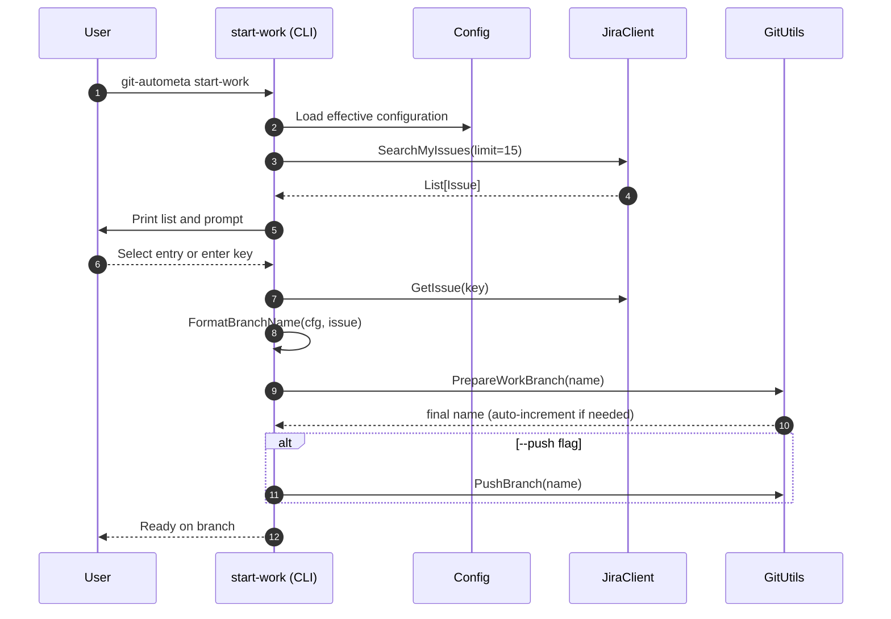
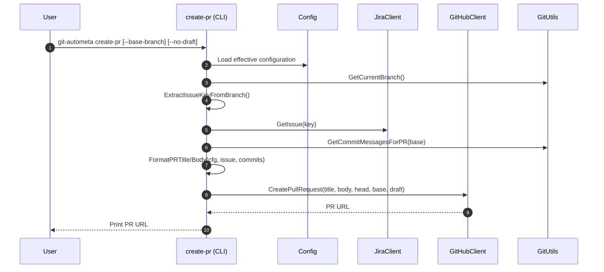

## git-autometa Architecture (Go)

This document describes the Go implementation: structure, workflows, and module interactions for contributors and maintainers.

### Goals
- Automate Git workflows around JIRA issues: branch creation and PR creation.
- Provide a simple CLI with safe defaults and minimal prompts.
- Centralize configuration (global + per-repo) with clear override rules.
- Integrate with JIRA via REST and GitHub via the `gh` CLI.

### High-Level Overview
- Entry point: `main.go` calls `internal/cli.Execute()`.
- CLI: Cobra commands in `internal/cli/` (`root.go`, `start_work.go`, `create_pr.go`, `config.go`, `status.go`).
- Configuration: `internal/config` types and helpers. Loads defaults, global file, and optional repo overrides under XDG config dir.
- JIRA client: `internal/jira` provides a small REST client and `Issue` model.
- Markdown conversion: `internal/markdown` converts Jira wiki markup to GitHub Markdown.
- Git utilities: `internal/git` wraps `git` CLI for branch, commit, and remote operations.
- GitHub client: `internal/github` wraps the `gh` CLI for PR operations.
- Secrets: `internal/secrets` stores Jira tokens in the OS keyring under a single service.

### Module Responsibilities and Contracts

- `internal/cli/root.go`
  - Defines the root command `git-autometa` and persistent flags: `-v/--verbose`, `--owner`, `--repo`.

- `internal/cli/config.go`
  - Commands: `config global`, `config repo`, `config show`.
  - Global: prompts for Jira `server_url`, `email`, optionally stores token to keyring via `internal/secrets`.
  - Repo: writes overrides to `~/.config/git-autometa/repositories/{owner}_{repo}.yaml`.
  - `config show`: prints the merged, effective config as YAML.

- `internal/cli/start_work.go`
  - Command: `start-work [JIRA-KEY] [--push]`.
  - If no key is provided, lists up to 15 assigned issues via `jira.Client.SearchMyIssues` and prompts selection; falls back to manual entry on error or empty list.
  - Formats branch names using `Config.Git.BranchPattern` and placeholders `{jira_id}`, `{jira_title}`, `{jira_type}`; sanitizes and truncates per `MaxBranchLength`.
  - Calls `git.Utils.PrepareWorkBranch`, which fetches, determines `main` or `master`, and creates the branch; auto-increments name if it exists locally or remotely. Optionally pushes with `--push`.

- `internal/cli/create_pr.go`
  - Command: `create-pr [--base-branch <name>] [--no-draft]`.
  - Extracts the first `ABC-123` token from the current branch. Fetches the issue to populate title/body.
  - Title from `PullRequest.TitlePattern`. Body from `PullRequest.Template` with placeholders:
    - `{jira_id}`, `{jira_title}`, `{jira_type}`, `{jira_url}`, `{jira_description}`
    - `{commit_messages}`: bullets from `git.Utils.GetCommitMessagesForPR(base)` with common Jira tags removed.
  - Creates the PR via `github.Client.CreatePullRequest` (`gh pr create --json url`).

- `internal/config`
  - Types: `Config`, `JiraConfig`, `GitHubConfig`, `GitConfig`, `PullRequestConfig`.
  - Defaults via `DefaultConfig()`; load/merge with `LoadEffectiveConfig(paths...)` where last wins.
  - Paths via XDG: `GlobalConfigPath()` and `RepoConfigPath(owner, repo)`.
  - `SaveRepoConfig` writes per-repo overrides.

- `internal/jira`
  - `Client` with `NewClientWithKeyring(Config)` reads token from keyring (`internal/secrets`).
  - `SearchMyIssues(limit)` and `GetIssue(key)`; builds issue URLs; converts descriptions to Markdown via `internal/markdown`.

- `internal/git`
  - Branch preparation, push, current branch detection, commit message listing, and remote URL retrieval.
  - Auto-increment branch names when conflicts are detected locally or on `origin`.

- `internal/github`
  - Wraps `gh auth status`, `gh pr create`, and `gh pr list`. Supports `--repo <owner>/<repo>` when configured.

- `internal/markdown`
  - Jira wiki → GitHub Markdown: headings, lists, inline styles, links, code/quote blocks, and basic tables.

- `internal/secrets`
  - OS keyring wrapper using a single service `git-autometa` with keys `jira:<email>`.

### Key Flows

#### A) Start Work (interactive)

#### B) Create Pull Request

### Configuration Resolution and Storage
- Locations:
  - Global: `~/.config/git-autometa/config.yaml`
  - Repo: `~/.config/git-autometa/repositories/{owner}_{repo}.yaml`
- Priority (last wins): repo-specific → global → defaults.
- Keys (non-exhaustive):
  - `jira.server_url`, `jira.email`
  - `github.owner`, `github.repo`
  - `git.branch_pattern`, `git.max_branch_length`
  - `pull_request.title_pattern`, `pull_request.draft`, `pull_request.base_branch`, `pull_request.template`

### Security Considerations
- Jira API token is stored in the OS keyring under service `git-autometa` with keys like `jira:<email>`.
- GitHub authentication is delegated to `gh`. No GitHub tokens are stored by this tool.

### Error Handling
- Commands print errors and exit with non-zero codes without dumping usage on runtime errors.
- Network/CLI failures are surfaced with concise messages (e.g., run `gh auth login`, configure Jira).

### Testing and Local Development
- Build and test with:
  - `go build .`
  - `go test ./...`

### Future Improvements
- Configurable JQL for issue searches.
- Non-interactive flags for alternative branch naming policy.
- Better heuristics for extracting the JIRA key from branch names.

