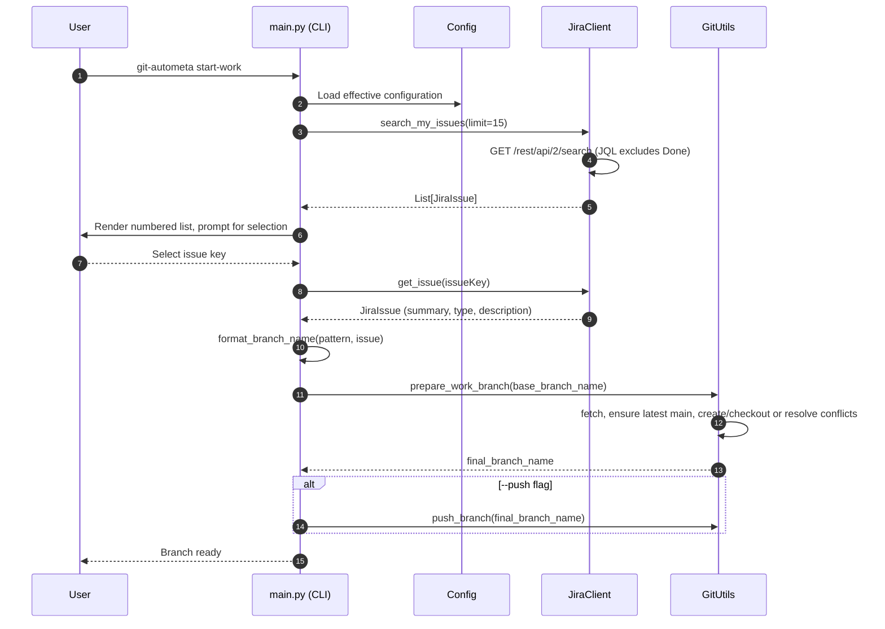
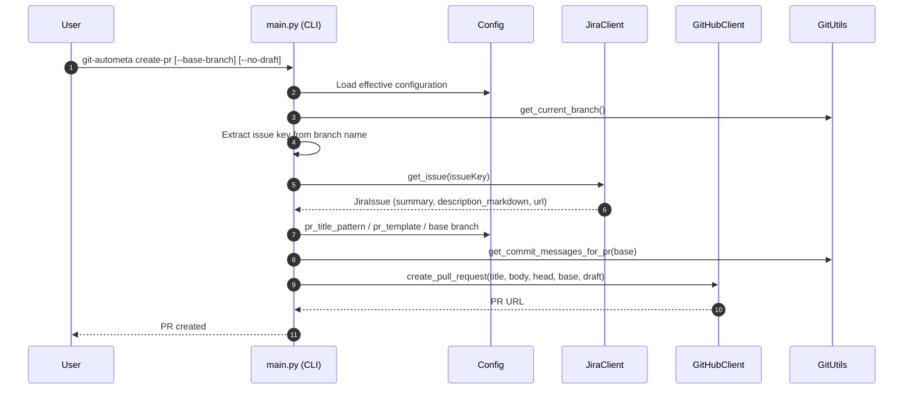

## git-autometa Architecture

This document explains how git-autometa is structured, how the main workflows operate end-to-end, and how the modules interact. It is intended for contributors and maintainers.

### Goals
- Automate common Git workflows around JIRA issues: branch creation and PR creation.
- Provide a friendly CLI with safe defaults, prompts, and rich output.
- Keep configuration centralized (global + per-repo) with clear override rules.
- Integrate with JIRA via REST API and GitHub via the `gh` CLI.

### High-Level Overview
- CLI entrypoint: `git_autometa.main:cli` (registered in `pyproject.toml`).
- Configuration: `git_autometa.config.Config` resolves effective settings from global and repo-specific files, with a custom-config override.
- JIRA client: `git_autometa.jira_client.JiraClient` handles API calls and maps responses to `JiraIssue` objects.
- Markdown conversion: `git_autometa.jira_markdown_converter` converts JIRA markup to GitHub-friendly Markdown for PR descriptions.
- Git utilities: `git_autometa.git_utils.GitUtils` wraps Git operations via GitPython and some subprocess commands.
- GitHub client: `git_autometa.github_client.GitHubClient` delegates to the `gh` CLI for PR operations.

### Module Responsibilities and Contracts

- `git_autometa.main`
  - Defines the CLI via `click` with commands:
    - `start-work [JIRA-KEY] [--push]`
    - `create-pr [--base-branch <name>] [--no-draft]`
    - `config` group: `global`, `repo`, `show`
    - `status`
  - Initializes logging via `rich` and loads `Config`.
  - Orchestrates interactions among `JiraClient`, `GitUtils`, and `GitHubClient`.
  - Provides `select_jira_issue_interactively` to list and choose assigned issues (excludes Done issues at source).
  - Provides `format_branch_name(pattern, issue, max_length)` to build branch names.

- `git_autometa.config.Config`
  - Centralized config directory: `~/.config/git-autometa/`.
    - Global config: `config.yaml`.
    - Repo config: `repositories/{owner}_{repo}.yaml`.
  - Resolves values with priority: repo-specific → global → defaults.
  - Detects current repo identity via `GitUtils.get_remote_url("origin")` and URL parsing.
  - Offers helpers for common values (e.g., `jira_server_url`, `branch_pattern`, `pr_template`, etc.).
  - Supports saving global, repo, or a custom config path.

- `git_autometa.jira_client.JiraClient`
  - Auth: uses `keyring` to retrieve an API token stored under service `git-autometa-jira` with the user email as key.
  - `test_connection()`: GET `/rest/api/2/myself` to verify credentials and connectivity.
  - `search_my_issues(limit=15)`: Uses JQL to fetch issues assigned to current user, excluding Done category, ordered by last updated.
    - JQL: `assignee = currentUser() AND statusCategory != Done ORDER BY updated DESC`
    - Returns a list of `JiraIssue`, each enriched with a computed `url`.
  - `get_issue(issue_key)`: GET `/rest/api/2/issue/{key}` with validation and returns `JiraIssue`.

- `git_autometa.jira_client.JiraIssue`
  - Thin wrapper over the JIRA issue JSON with properties: `key`, `summary`, `description`, `issue_type`, `status`, `assignee`, `url`.
  - `description_markdown` converts JIRA markup using `convert_jira_to_markdown`.
  - `slugify_title(max_length)` builds a safe branch slug from the issue summary.

- `git_autometa.jira_markdown_converter`
  - Regex-driven conversion from JIRA markup (headers, lists, code/quote blocks, tables, inline styles) to GitHub Markdown.
  - Exposed via `convert_jira_to_markdown(jira_text)`.

- `git_autometa.git_utils.GitUtils`
  - Repository discovery via GitPython (searching parent directories).
  - Branch operations: create, checkout, push, determine main branch, fetch/pull.
  - Safety and UX:
    - `prepare_work_branch(base_branch_name)`: fetches, ensures latest main, then creates branch or resolves conflicts via interactive prompt:
      - If branch exists locally/remotely, prompt: switch to existing vs. create alternative name (auto-increment suffix).
    - Provides helpers for status, uncommitted changes, stashing, and PR commit message extraction.
  - PR commit messages: uses `git log` to build a bulleted list, removing leading JIRA tags like `[ABC-123]`.

- `git_autometa.github_client.GitHubClient`
  - Requires `gh` CLI installed and authenticated (`gh auth status`).
  - Repository context via `gh repo view`.
  - Creates PRs via `gh pr create` (supports draft flag and base branch override).
  - Provides basic helpers to test connection and list PRs.

### Key Flows

#### A) Start Work (with interactive selection)

#### B) Create Pull Request

### Configuration Resolution and Storage
- Default locations:
  - Global: `~/.config/git-autometa/config.yaml`
  - Repo: `~/.config/git-autometa/repositories/{owner}_{repo}.yaml`
- Priority when reading values:
  1. Repo-specific config (if present)
  2. Global config
  3. Built-in defaults in `Config` properties
- Custom config path (`--config`) bypasses centralized storage and reads/writes the provided file.

Common keys (non-exhaustive):
- `jira.server_url`, `jira.email`
- `git.branch_pattern` (default `feature/{jira_id}-{jira_title}`), `git.max_branch_length`
- `pull_request.title_pattern`, `pull_request.draft`, `pull_request.base_branch`, `pull_request.template`

### Security Considerations
- JIRA API token is stored via `keyring` (service: `git-autometa-jira`, key: user email). No tokens in config files.
- GitHub authentication is delegated to the `gh` CLI; this tool does not handle GitHub tokens directly.

### Error Handling and Logging
- Logging configured via `rich.logging.RichHandler`; verbosity controlled by `-v` (DEBUG) or default INFO.
- Fail-fast scenarios with clear console messages and non-zero exit on fatal errors (e.g., missing config, invalid repo, API errors).
- Network/CLI errors are caught and surfaced with actionable hints (e.g., run `gh auth login`, configure JIRA).

### Notable Implementation Details
- Issue filtering: `search_my_issues` excludes issues in JIRA’s Done category using `statusCategory != Done`.
- Interactive issue list is reversed before display so the most recent appears at the bottom of the list.
- Branch conflict handling presents a simple two-option prompt and auto-increments the alternative name.
- PR body combines converted JIRA description with a reverse-chronological bullet list of commit messages relative to base.

### Extensibility
- Additional providers:
  - JIRA alternatives could be implemented behind a similar client abstraction and wired into `main.py`.
  - Git hosting alternatives (e.g., GitLab) could be supported via a new client that mirrors the `GitHubClient` interface.
- Configuration:
  - New keys should be added as `Config` properties with sensible defaults.
- CLI:
  - New commands should follow the existing `click` patterns, reuse `Config`, and integrate with existing clients.

### Dependencies and Runtime Environment
- Python 3.8+
- `GitPython`, `click`, `rich`, `requests`, `PyYAML`, `keyring`
- `gh` CLI for GitHub operations (installed and authenticated)
- A valid Git repo workspace when running git-related commands

### File and Module Map
- `src/git_autometa/main.py`: CLI, orchestration, formatting, prompts, commands.
- `src/git_autometa/config.py`: Centralized config management and resolution.
- `src/git_autometa/jira_client.py`: JIRA integration and issue model.
- `src/git_autometa/jira_markdown_converter.py`: JIRA→Markdown conversion utilities.
- `src/git_autometa/git_utils.py`: Git operations and branching workflow helpers.
- `src/git_autometa/github_client.py`: GitHub integration via `gh`.

### Testing and Local Development
- Dev dependencies declared in `pyproject.toml` under `[tool.uv].dev-dependencies`.
- Typical workflow:
  - `uv sync --dev` to install dev deps
  - `pytest` to run tests
  - `black src/` and `flake8` for formatting/linting

### Future Improvements
- More robust extraction of JIRA key from branch names in `create-pr`.
- Configurable JQL for issue searches (e.g., include custom statuses/boards).
- Non-interactive flags for branch conflict handling.
- Better error categorization and retry strategy for transient network issues.

